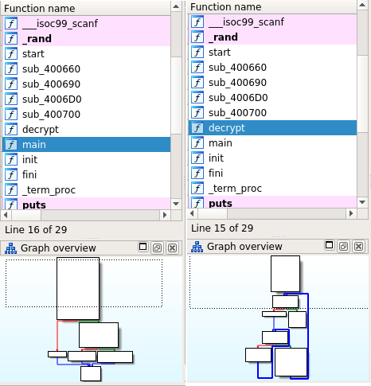
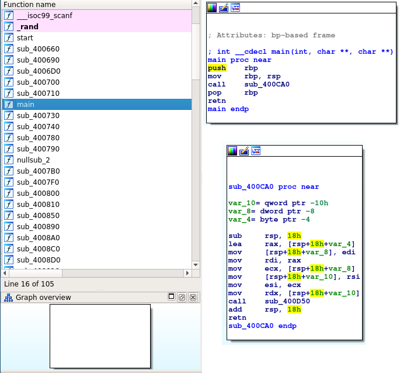

# LLVM Obfuscation Pass via Extracted Basic Blocks

Obfuscate a target program by converting all branches between basic blocks to
call instructions.


## Description

This project provides two LLVM passes that can be used to obfuscate a target
program by modifying the program's control flow and call graph. The control
flow for individual functions will be obfuscated by converting transitions
between basic blocks from traditional branch instructions to calls. This has
the effect of making a function's control flow logic interprocedural, which is
often poorly handled by traditional reverse engineering tools.

Each optimization pass is implemented as an LLVM plugin. The `LLVMExtractBB.so`
plugin will convert basic block transitions to calls. The `LLVMExtractInst.so`
plugin will split basic blocks into individual instructions before modifying
any transitions. This causes a significant increase in the number of resulting
functions.

When compiled with clang-8, IDA identifies 29 total functions in this short
test program (including imports).



When compiled with LLVMExtractInst enabled, IDA identifies 105 total functions.
Most functions have a similar CFG (a singular basic block or four basic blocks
in a diamond pattern).



Note that loops in a function will be transformed into recursive function calls
as a side effect of this pass. As such, infinite or high repitition loops may
result in stack exhaustion.


## Build Instructions

This project can be built as an out-of-tree module, or directly within the LLVM
source tree.

### Out of Tree Build

1. Install build dependencies.

    ```
    apt install cmake clang-8 llvm-8.0-dev
    ```

1. Compile the plugins with cmake.

    ```
    mkdir build && cd build
    cmake ..
    make -j2
    ```

### In Tree Build

1. Create a symlink or copy the `ExtractBB` directory to
`<LLVM_root>/lib/Transforms`.

1. Add `add_subdirectory(ExtractBB)` to
`<LLVM_root>/lib/Transforms/CMakeLists.txt`.

1. Build LLVM as described in the LLVM documentation.


## Usage

Either plugin can be loaded directly from clang, or invoked manually with the
`opt` tool. If loaded by clang, the plugin's pass will automatically run
regardless of the optimization level. If loaded by `opt`, you must specify an
additional flag to enable the pass.

To compile using clang:

    clang-8 -Xclang -load -Xclang ./LLVMExtract(BB|Inst).so file.c

To compile using `opt`:

    clang-8 -c -emit-llvm file.c
    opt-8 -load ./LLVMExtract(BB|Inst).so -extractbb file.bc > file_opt.bc
    clang-8 file_opt.bc

### Debugging the Plugin

To debug or view statistics generated by this plugin, the following additional
options can be passed to `opt`.

Print debug output from all passes:

    opt-8 -debug -load ./LLVMExtract(BB|Inst).so -extractbb file.bc > file_opt.bc

Print debug output from only this plugin's pass:

    opt-8 -debug-only=extractbb -load ./LLVMExtract(BB|Inst).so -extractbb file.bc > file_opt.bc

Print duration of all passes:

    opt-8 --time-passes -load ./LLVMExtract(BB|Inst).so -extractbb file.bc > file_opt.bc

Print the pass structure:

    opt-8 --debug-pass=Structure -load ./LLVMExtract(BB|Inst).so -extractbb file.bc > file_opt.bc

Debug the pass itself:

    gdb opt-8
    run -load ./LLVMExtract(BB|Inst).so -extractbb file.bc > file_opt.bc
